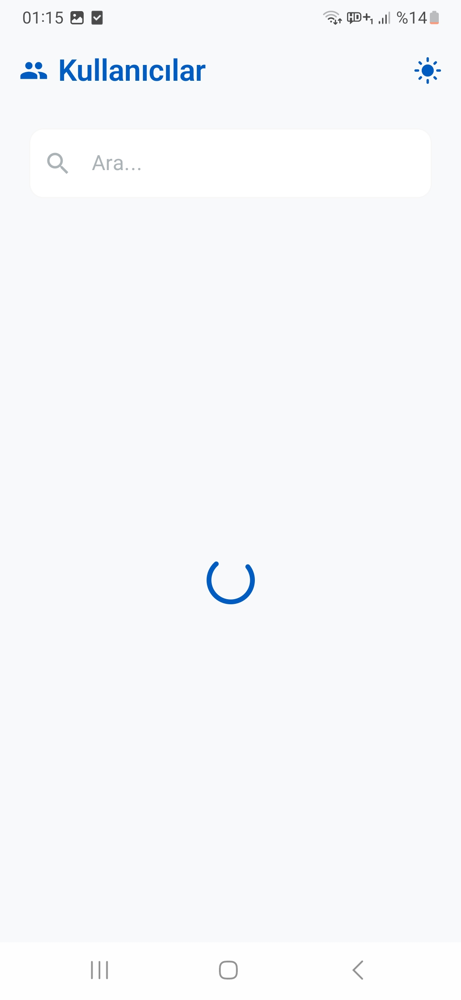
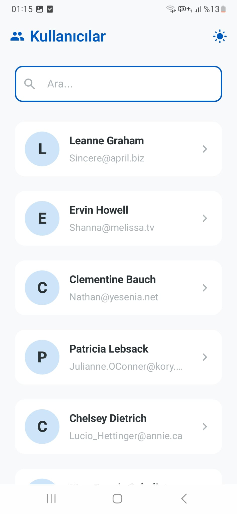
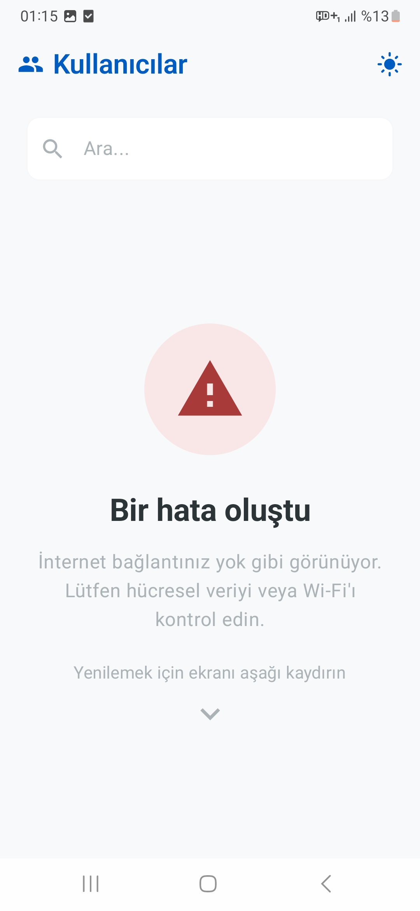
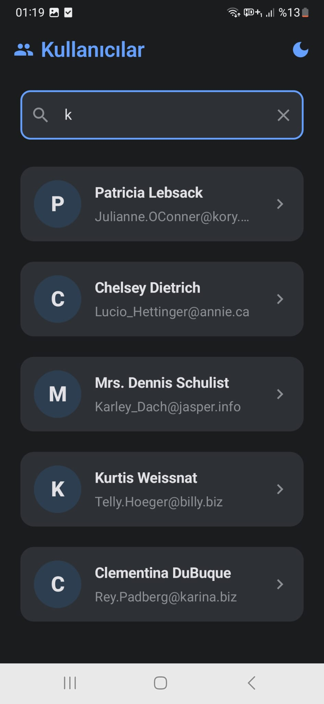
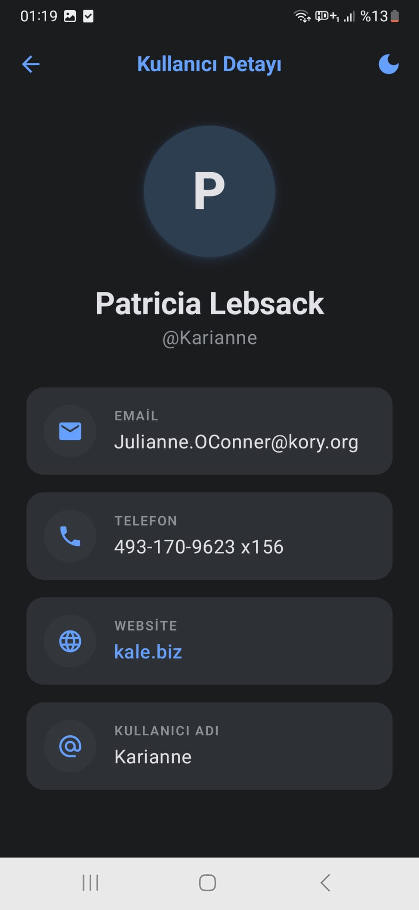

# 👥 UserApp

UserApp, JSONPlaceholder API üzerinden kullanıcı verilerini çekip modern bir Android arayüzünde listeleyen ve detaylarını gösteren bir uygulamadır.  

Bu proje; **MVVM mimarisi**, **Jetpack Compose**, **Hilt**, **Retrofit** ve **StateFlow** kullanılarak geliştirilmiştir.


---
## 🚀 Özellikler

### ✅ Temel Özellikler
- API’den kullanıcı verilerini çekme
- Kullanıcıları listeleme (LazyColumn)
- Loading / Error / Success state yönetimi
- Modern Material 3 tasarım

### ⭐ Bonus Özellikler
- 🔍 **Arama (Search):** İsim ve email’e göre filtreleme  
- 📄 **Detay Ekranı:** Kullanıcıya tıklayınca detay sayfasına geçiş  
- 🔄 **Pull-to-Refresh:** Listeyi aşağı çekerek yenileme  
- 🧩 **Hilt (Dependency Injection):** Temiz ve sürdürülebilir mimari  
- 🌙 **Dark Mode:** Açık/Koyu tema desteği  
---
## 🛠️ Kullanılan Teknolojiler ve Mimari

* **Programlama Dili:** [](https://kotlinlang.org/)
* **Kullanıcı Arayüzü (UI):** [](https://developer.android.com/jetpack/compose) [](https://m3.material.io/)
* **Mimari Desen:** [](#)
* **Dependency Injection:** [](https://dagger.dev/hilt/)
* **Ağ İstekleri:** [](#) [](#)
* **Asenkron İşlemler:** [](https://kotlinlang.org/docs/coroutines-overview.html)
* **Navigasyon:** [](https://developer.android.com/jetpack/compose/navigation)
---
## 📦 Proje Yapısı

```text
com.mustafaderinoz.userapp
├── data                      # Veri katmanı (API, model, repository)
│   ├── model                 # Veri modelleri (data class'lar)
│   │   └── User.kt           # Kullanıcı veri modeli
│   ├── remote                # API işlemleri
│   │   ├── ApiService.kt     # Retrofit API endpoint tanımları
│   │   └── RetrofitInstance.kt # Retrofit yapılandırması (base URL vb.)
│   └── repository            # Veri erişim katmanı (abstraction)
│       └── UserRepository.kt # API'den veri çekip ViewModel'e sağlar
│
├── di                        # Dependency Injection (Hilt)
│   └── AppModule.kt          # Retrofit ve ApiService provider'ları
│
├── ui                        # UI katmanı (Jetpack Compose)
│   ├── components            # Tekrar kullanılabilir UI bileşenleri
│   │   └── UserItem.kt       # Kullanıcı liste item tasarımı
│   ├── screen                # Ekranlar
│   │   ├── UserListScreen.kt # Kullanıcı liste ekranı
│   │   └── UserDetailScreen.kt # Kullanıcı detay ekranı
│   └── theme                 # Tema ve stil ayarları
│       ├── Color.kt          # Renk tanımları
│       ├── Theme.kt          # Light/Dark tema ayarları
│       └── Type.kt           # Typography ayarları
│
├── utils                     # Yardımcı fonksiyonlar
│   └── Exceptions.kt         # Hataları kullanıcı dostu mesaja çevirir
│
├── viewmodel                 # UI state yönetimi
│   └── UserViewModel.kt      # UI state, veri çekme ve iş mantığı
│
├── MainActivity.kt           # Uygulama giriş noktası ve navigation yönetimi
└── UserApp.kt                # Hilt Application class
```
---
## 📱 Ekran Görüntüleri

|⏳ Loading |✅ Success  |❌ Error |
|----------------------|------------------|----------------|
|  |  |  |

|🌙 Liste |🌑 Detay  |
|----------------------|------------------|
|  |  | 
---

## ⚙️ Kurulum ve Çalıştırma

Projeyi yerel ortamında çalıştırmak için aşağıdaki adımları izleyebilirsin:


**1. Depoyu klonla**
```bash
git clone https://github.com/mustafaderinoz/Turkcell-GYGY-KullaniciListesi.git
```
**2. Android Studio ile aç**
- File > Open seçeneği ile projeyi içeri aktar
  
**3. Gradle senkronizasyonu**
- Gerekli bağımlılıkların yüklenmesini bekle
  
**4. Uygulamayı çalıştır**
- Bir emülatör veya gerçek cihaz bağla ve projeyi başlat

---

## 👨‍💻 Geliştirici

**Mustafa Derinöz**

